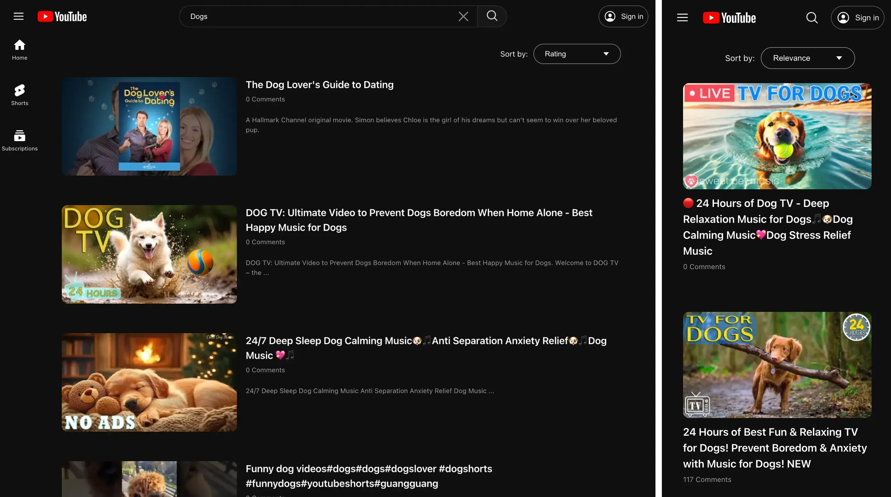

# YouTube Search Clone

This project is a YouTube search clone built using **Lit** and **Web Components**.


## Requirements

- Node.js 18 or later
- A modern browser that supports ES Modules (e.g. Chrome, Firefox, Safari, Edge)
- A YouTube Data API key (optional – for real-time search)

## Getting Started

### 1. Install dependencies

```bash
npm install
```

### 2. Add your API key (optional)

Create a `.env` file at the root and add the following line with your YouTube API key.

```
VITE_YOUTUBE_API_KEY=your_api_key_here
```

> If no API key is provided, the app uses mock data for search results and video statistics. Sorting will still function, but video stats will not update across sort changes.

### 3. Start development server

```bash
npm run dev
```

You can then view the application at http://localhost:5173

## Features

- Keyword search
- Sort by relevance, date, or rating
- Pagination
- Toggleable side drawer navigation
- Responsive design

## Notes

- This project was built using Vite and the Lit package from npm.
- All components and functionality were implemented from scratch.
- The layout and styling were intentionally designed to closely match YouTube’s current interface.
